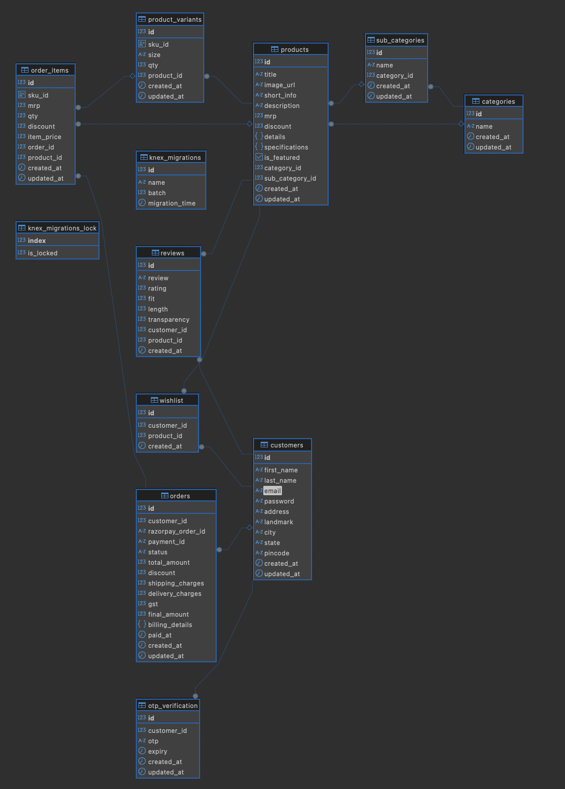

# One-Stop E-Commerce Backend

A robust backend API for an e-commerce platform built with **Node.js**, **Express**, **Knex.js**, and **PostgreSQL**.  
It handles user authentication, product management, categories, wishlists, orders, and more.

---

## 🗂️ Tech Stack

```plaintext
•	Runtime: Node.js
•	Framework: Express.js
•	Database: PostgreSQL
•	Query Builder: Knex.js
•	Auth: JWT
•	Env Config: dotenv
•	Linter: ESLint (optional)
```

## 📂 Project Structure

```plaintext
project-root/
│── migrations/    # Knex migration files
│── seeds/         # Knex seed files for mock/test data
│── mock-data/     # Json data for testing
│── knexfile.js    # Export database configuration
│
├── src/
│   ├── controllers/   # Route controllers (business logic)
│   ├── routes/        # API route definitions
│   ├── db/            # Knex config and DB setup
│   ├── middlewares/   # Custom middleware (e.g. error handler)
│   ├── config/        # Config files (env vars, knex config)
│   ├── index.js       # Express app setup
│   ├── server.js      # Entry point
│
├── .env               # Environment variables
├── package.json       # Project metadata & dependencies
└── README.md          # This file!
```

## 🚀 Features

```plaintext
✅ User authentication with JWT with OTP verification
✅ Products, categories & subcategories CRUD operations
✅ Wishlist & reviews system
✅ Advanced filtering, sorting & search
✅ Creating and closing orders with razorpay integration
✅ Secure environment configs with .env
✅ Database migrations & seeds with Knex
✅ Custom error handling middleware
✅ Modular MVC architecture
```

## ⚙️ Setup

```plaintext
1️⃣ Clone the repository
2️⃣ Install dependencies
3️⃣ Configure environment using .env
4️⃣ Run database migrations - npx knex migrate:latest --env development
5️⃣ Run seed files (optional) - npx knex seed:run --env development
6️⃣ Start the server - npm run dev
```

## Env Variables
```
 DB_HOST: db
 DB_USER: postgres
 DB_PASSWORD: your_password
 DB_NAME: your_db_name
 DB_PORT: 5432
 ACCESS_TOKEN_SECRET: your_access_token_secret
 REFRESH_TOKEN_SECRET: your_refresh_token_secret
 SMTP_HOST: smtp.gmail.com
 SMTP_USER: your_smtp_user
 SMTP_PASS: your_smtp_pass
 RAZORPAY_KEY_ID: your_key_id
 RAZORPAY_KEY_SECRET: your_key_secret
 CLIENT_URL: your_client_url
```

## 💻 Test the API Locally (cURL Examples)
```
All endpoints assume backend runs on `http://localhost:8080/api`
For protected routes, replace `Authorization: ••••••` with your JWT access token.
```

### Register User
```
curl --location 'http://localhost:8080/api/auth/register' \
--header 'Content-Type: application/json' \
--data-raw '{
    "firstName": "Vaishali",
    "lastName": "Bhoyar",
    "email": "vaishubhoyar004@gmail.com",
    "password": "vaishali123"
}'
```
### Request Otp
```
curl --location 'http://localhost:8080/api/auth/request-otp' \
--header 'Content-Type: application/json' \
--data-raw '{
    "email": "vaishubhoyar004@gmail.com"
}'
```
### Verify Otp
```
curl --location 'http://localhost:8080/api/auth/verify-otp' \
--header 'Content-Type: application/json' \
--data-raw '{
    "email": "vaishubhoyar004@gmail.com",
    "otp": "991130"
}'
```
### Generate Access Token
```
curl --location 'http://localhost:8080/api/auth/access-token' \
--header 'Content-Type: application/json' \
--data-raw '{
    "email": "vaishubhoyar004@gmail.com"
}'
```
### Get Products
```
curl --location 'http://localhost:8080/api/categories/all'
```
### Get Product Details
```
curl --location 'http://localhost:8080/api/products/1?viewOnly=true' \
--data ''
```
### Create Order
```
curl --location 'http://localhost:8080/api/orders/create' \
--header 'Content-Type: application/json' \
--header 'Authorization: ••••••' \
--data '{
    "items": [{
        "id": 11,
       "cartQty": 1,
       "sku_id": "58e9e7c2-7beb-45ca-84c8-000cfb191402",
       "discount": 10,
       "mrp": 4500,
       "priceAfterDiscount" : 4050
     }]
}'
```
### Verify Payment
```
curl --location 'http://localhost:8080/api/orders/payment/verify' \
--header 'Content-Type: application/json' \
--header 'Authorization: ••••••' \
--data '{
    "razorpay_order_id": "order_QmXrIltoMo9oSW",
    "razorpay_payment_id": "pay_QmXsZ55hNbIpD6",
    "razorpay_signature" : "78c66d9e7d7c5c0bff39119b53f87b9f0457bdd4ec7c69dd9aa4d6b35c7636f6"
}'

...
```
---

## 🗃️ Database Design

The application uses a **PostgreSQL relational database** with a normalized schema.

### ER Diagram



### Main Tables

| Table              | Description                                  |
|--------------------|----------------------------------------------|
| `customers`        | Registered customers                         |
| `products`         | All product listings                         |
| `categories`       | Main product categories (MEN, WOMEN, etc.)   |
| `sub_categories`   | Subcategories linked to categories           |
| `product_variants` | Variants (size, color, qty) for each product |
| `wishlist`         | User wishlist mapping                        |
| `reviews`          | Product reviews                              |
| `orders`           | Customer orders                              |
| `order_items`      | Customer order items                         |
| `otp_verification` | Otp related information                      |

### Key Relationships

- `products.category_id` → `categories.id`
- `products.sub_category_id` → `sub_categories.id`
- `sub_categories.category_id` → `categories.id`
- `product_variants.product_id` → `products.id`
- `wishlist.product_id` → `products.id`
- `wishlist.customer_id` → `customers.id`
- `reviews.product_id` → `products.id`
- `reviews.customer_id` → `customers.id`
- `orders.customer_id` → `customers.id`

All foreign keys use **`ON DELETE CASCADE`** where appropriate.

---

```plaintext
Use case: 
This repository is shared publicly only to showcase my work and skills.

Restrictions: 
You may not copy, reuse, modify, or distribute any part of this project without my written permission.

If you wish to contribute or have any open issues, please contact me: vaishubhoyar004@gmail.com

© 2025 Vaishali Bhoyar. All rights reserved.
```
